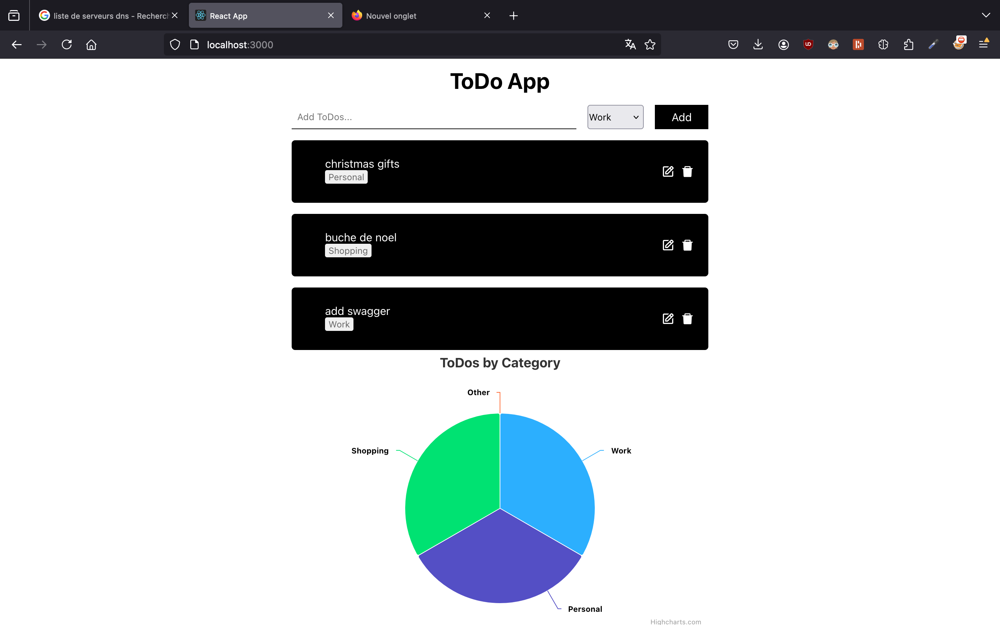
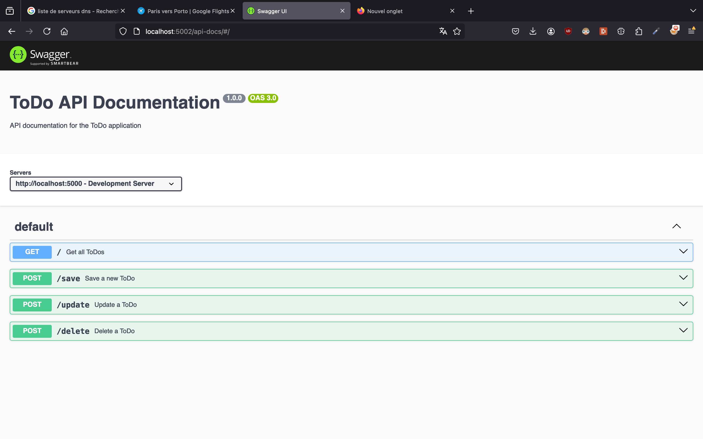

# Projet_node_CDOF5_Yannis_Guilherme_Dany_Noufel

### Members of the project
Dany MOURAD
Guilherme MIRANDA MARTINS
Yanis ANDRE
Noufel BOUCHENEB
[github](https://github.com/yannisandre/Projet_node_CDOF5_Yannis_Guilherme_Dany_Noufel)

#### Our project
We created a todolist website implementing different technologies seen in class.
We tried implementing ag-grid but for an unknown reason (no compiling errors) the frontend wasn't loading.
We used highcharts to display the distribution of each category.
As an advanced feature we uploaded the website on the web to make a first step in real web development. We used netlify for frontend and render for backend.
Netlify being a free service we get this message after one hour of inactivity : 
```Your free instance will spin down with inactivity, which can delay requests by 50 seconds or more.```
There is a presentation video that is running on netlify

#### Individual work
Dany
1. Adapt and reword the td's to have a good foundation for the website
2. upload website on netlify
[website link](https://teal-genie-09261e.netlify.app/)

Guilherme 
1. Implented todo categories and highcharts
2. Helped Noufel and Yannis with mongodb
3. Readme

Noufel 
1. Tried using PostgreSQL for our database but it didn't work
2. mongodb with Guilherme and Yannis

Yannis
1. Mongodb with Guilherme and Noufel
2. Swagger


To run :
in frontend / backend
```bash
npm install
```

backend file : 
to use the project you have to connect your mongodb account
create an account and then add the file .env to the backendfolder
```
MONGODB_URL=mongodb+srv://LaLoupiotte:<db_password>@cluster0.opyyv.mongodb.net/?retryWrites=true&w=majority&appName=Cluster0
PORT=5000

```

```bash
npx nodemon --exec ts-node server.ts
```

frontend file :

```bash
npm start
```

#### Site


#### Swagger

